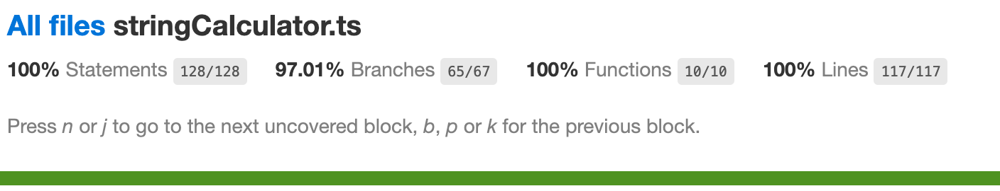

# 📝🔢 String Calculator

String Calculator allows a user to enter a math problem as a string and get an answer. It's built using [TypeScript](https://www.typescriptlang.org/) and [Jest](https://jestjs.io/).

Given the following input:

```
calculate('(4-2)*3.5')
```

This will be the output:

```
7
```

## How to Use

To run this command line application, all you need to do is install the dependencies via:

```sh
yarn
```

Or, if you're using `npm`:

```sh
npm install
```

There is a `postinstall` script that will compile the TypeScript to JavaScript in the `bin` folder.

To calculate an expression, just run:

```sh
./calculate "4*5/2"
```

## ⚒️ Development

### Running the Tests

```sh
yarn test
```

### Generating Code Coverage Reports

```sh
yarn test --coverage
```

### Running a Type Check

```sh
yarn tsc
```

## Test Coverage


