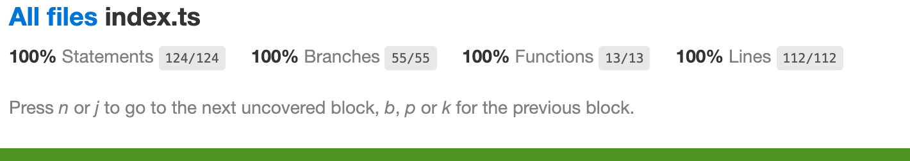

# 📝🔢 String Calculator

String Calculator allows a user to enter a math problem as a string and get an answer. It's built using [TypeScript](https://www.typescriptlang.org/) and [Jest](https://jestjs.io/).

Given the following input:

```
calculate('(4-2)*3.5')
```

This will be the output:

```
7
```

## ⚒️ Development

### Running the Tests

`yarn test`

### Running a Type Check

`yarn tsc`

## Production

To run this command line application:

## Test Coverage


